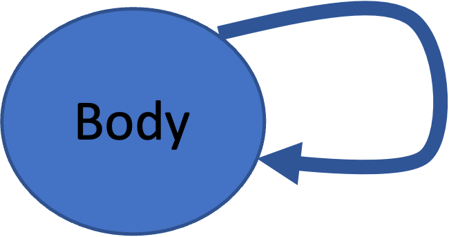

# Random 1d Snakes

Generate random 1d snakes.

Make using [pybullet](https://pybullet.org/wordpress/index.php/forum-2/), extending [pyrosim](https://github.com/jbongard/pyrosim) & in conjuction with the [ludobots reddit course](https://www.reddit.com/r/ludobots/wiki/installation/).

# Demo

[Youtube Video:](https://youtu.be/iytX9XCzkNo)

# Running the Code

After installing pyrosim and pybullet, clonse this repository and navigate to this directory. Now run `python3 buildbody.py`. This will generate a random 1d snake. Rerun this command to generate a new random snake.

# Structure of Code

The 1d snake is defined as a graph, where nodes represent body parts and edges represent connections between those body parts. To create a snake, a self-looping edge is used to denote the same body part should be spawned multiple times in a row:

This recursive edge is regulated by a `self.recursive_limit` in `bodynode.py` which limits the number of times the body part can connect to itself.

This code is not complete as it only supports recursive edges. However, it has been written in such a way that it can easily be expanded to support outgoing, non-recursive edges.
